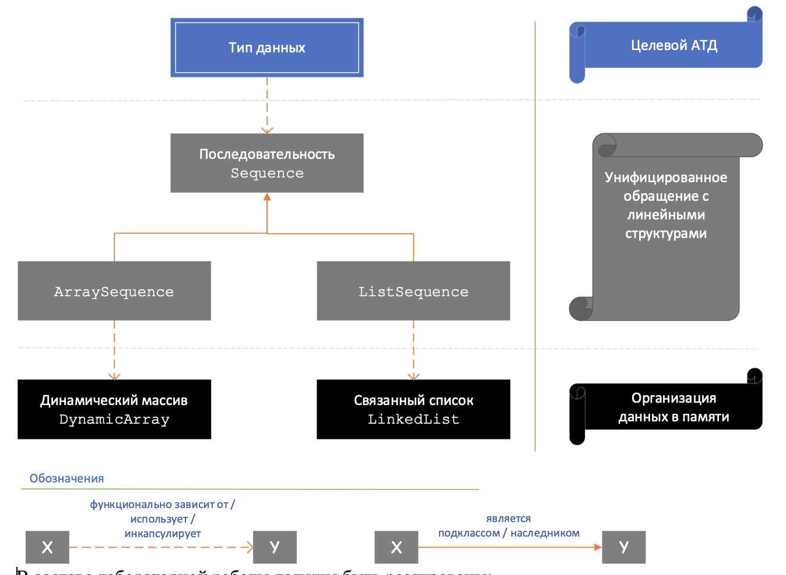

# Laboratory work semester 2. Algorithms and data structures.
## Laboratory work №1
This laboratory work is a preparation for the rest
## Laboratory work №2
### 1. Problem statement
Write an implementation of a polymorphic abstract data type in C++ using several levels of abstraction. At the lower level, structures are implemented for organizing data in memory – a dynamic array and a linked list. The abstraction (ATD sequence) is located at the level above, which provides opportunities for unified work with all structures of the lower level. The target ATD, the implementation of which is the ultimate goal of the task, is located at the highest level and uses the ATD sequence to implement most operations, see the diagram in Fig. Below

As part of the laboratory work should be implemented:
+ ATD dynamic array,
+ ATD linear linked list,
+ ATD sequence,
+ The target AD specified in the task option.

For implementation, it is necessary to use the capabilities of OOP and C++ templates (templates) – classes and functions. In all implemented functions, it is necessary to handle cases of incorrect values of input parameters – as a rule, exceptions should be thrown in such cases.
All implemented classes and basic algorithms must be covered with (modular) tests. The implementation should be equipped with a user interface (console) to check the correctness of the implementation.

### 2. Requirements for data structures

`template <class T> class DynamicArray`

| Functions and Methods  | Description |
| ------------- | ------------- |
| `DynamicArray(T* items, int count)` | Copy elements from the passed array  |
| `DynamicArray(int size) ` | Create an array of the specified length|
|  `DynamicArray(DynamicArray<T> & dynamicArray const)  `           |      Copying Constructor       |
| `T Get(int index)   `   |    Get an item by index.       |
|`int GetSize()`                |  Get the size of the array          |
|  `void Set(int index, T value)`            | Set an element by index            |
|  ` void Resize(int newSize)`          |       Change the size of the array.     |

#### 2.1. Class LinkedList
 `template <class T> class LinkedList    `                  

| Functions and Methods  | Description |
| ------------- | ------------- |
| `LinkedList (T\* items, int count)            `            | Copy elements from the passed array  |
| `LinkedList ()  `                                          | Create an empty list  |
| `LinkedList (LinkedList <T> & list const)   `              | Copying Constructor |
| `T GetFirst() `| Get the first item in the list  |
| `T GetLast()`| Get the last item in the list  |
| `T Get(int index)` | Get an item by index. |
| `LinkedList<T>\* GetSubList(int startIndex, int endIndex) `| Get a list of all the elements, starting with startIndex and ending with endIndex.  |
| `int GetLength()  `                                        | Get the length of the list |
| `void Append(T item) `                                     | Adds an item to the end of the list  |
| `void Prepend(T item)   `                                  | Adds an item to the top of the list  |
| `void InsertAt(T item, int index)`| Inserts an element at the specified position |
| `LinkedList<T>\* Concat(LinkedList<T> \*list) `            | Concatenates two lists |

#### 2.2. Class Sequence

`template <class T> class Sequence`

`template <class T> class ArraySequence : Sequence<T>`

`template <class T> class LinkedListSequence : Sequence<T> ` 

| Functions and Methods  | Description |
| ------------- | ------------- |
| ArraySequence (T\* items, int count); LinkedListSequence (T\* items, int count);     | Copy elements from the passed array  |
| ArraySequence ();   LinkedListSequence ()                                                                                                                                                        | Create an empty list | 
|LinkedListSequence (LinkedList <T> & list const);                                                                                                   | Copying Constructor |
| T GetFirst()| Get the first item in the list  |
| T GetLast(); | Get the last item in the list  |
| T Get(int index);                                                            | Get an item by index.  |
| Sequence<T>\* GetSubsequence(int startIndex, int endIndex) | Get a list of all the elements, starting with startIndex and ending with endIndex.  |
| int GetLength();                                                                                                                                                                                  | Get the length of the list |
| Операции                                                                                                                                                                                          |
| void Append(T item);                                                                                                                                                                              | Adds an item to the end of the list  |
| void Prepend(T item);                                                                                                                                                                             | Adds an item to the top of the list  |
| void InsertAt(T item, int index);                                                                                                                                                                 | Inserts an element at the specified position  |
| Sequence <T>\* Concat(Sequence <T> \*list);| Concatenates two lists|

#### Implementation of a square matrix
Coefficients:
+ Integers
+ Real numbers

Complex numbers: 
+ Addition 
+ multiplication by scalar
+ norm calculation
+ elementary row/column transformations

## Laboratory work №3
### Problem statement
Write in C++ an implementation of an abstract data type based on tree-type data structures.
### Minimum requirements for the program
In the program, depending on the variant, it is required to implement one of the following data structures: a binary tree or a 3-ary tree. For implementation, it is necessary to use dynamic structures based on pointers. The data structure should support working with elements of various types (generally speaking, arbitrary, if they satisfy certain conditions).
For implementation, it is necessary to use the capabilities of OOP and C++ templates (templates) – classes and functions. In all implemented functions, it is necessary to handle cases of incorrect values of input parameters – as a rule, exceptions should be thrown in such cases.
The main algorithms need to be covered with (modular) tests. The implementation should be equipped with a user interface (console) to check the correctness of the implementation. Perform speed testing of algorithms on large (10^4-10^5 elements) and very large (10^6-10^8) volumes of data. The results should be arranged in the form of a graph of the dependence of the execution time on the number of elements.
### Variant
+ Abstract data types from past variants.
+ Binary tree implementation
+ Binary Heap implementation

Binary tree implementation:
+ Crawls:
    + RootRightLeft
    + RootLeftRight
    + RightLeftRoot
    + RightRootLeft
    + LeftRightRoot
    + LeftRootRight
+ Types of stored elements:
    + Integers
    + Real numbers
    + Complex numbers
+ Configuration
    + map (build a new tree by element-by-element transformation)
    + where (to build a new tree, which includes only those nodes of the original one that satisfy the specified condition)
    + Merge
    + Extraction of a subtree (by a given element)
    + Search for the occurrence of a subtree
    + Searching for an element to occur
    + Saving to a string according to the specified crawl
    + Reading from a string according to the specified crawl
    + Node search by a given path, relative path search
    + Balancing
    + Firmware
    + Saving to a string
Binary Heap implementation:
    + insert
    + search
    + delete
    + implementation via pointers to nodes
    + Extracting a subtree (by a given element)
    + Search for the occurrence of a subtree
    + Saving to a string
    + Reading from a string

